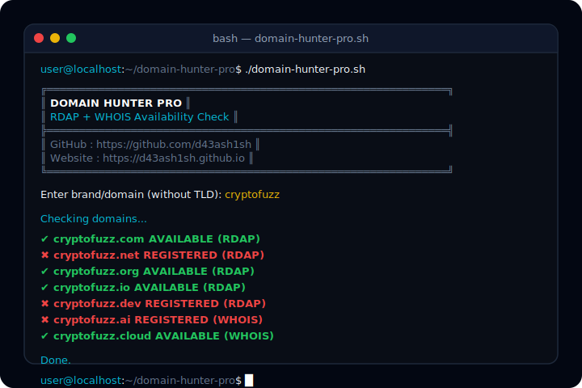
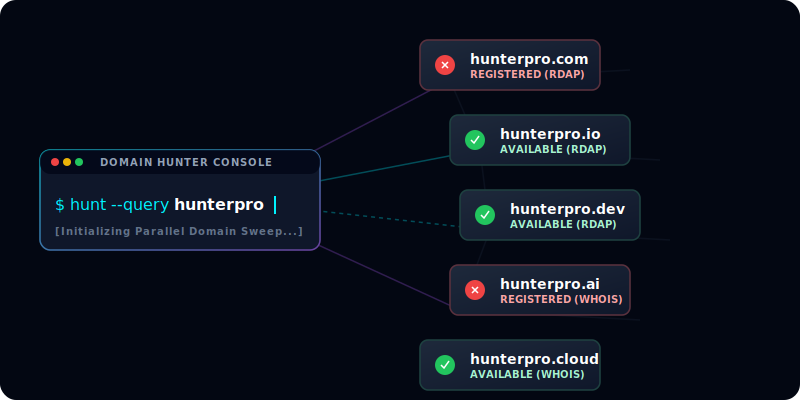
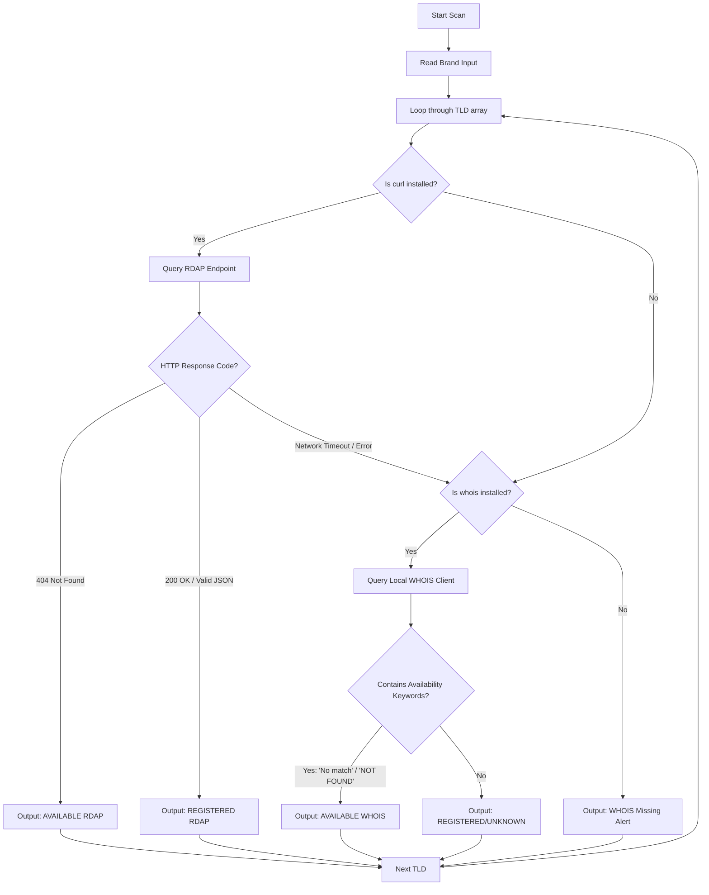
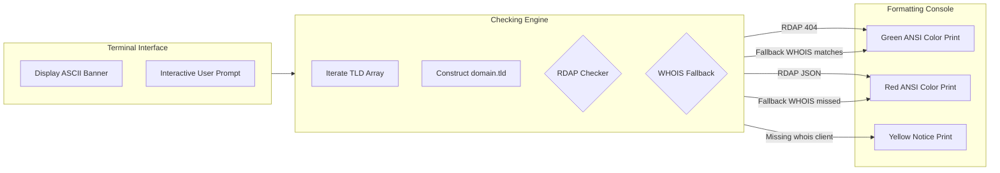

<p align="center">
  <a href="https://github.com/d43ash1sh/domain-hunter-pro">
    
  </a>
</p>

<h1 align="center">🛰️ DOMAIN HUNTER PRO</h1>

<p align="center">
  
</p>

<p align="center">
  <strong>An insanely fast, lightweight, and local shell utility that checks domain availability using a smart hybrid RDAP &amp; WHOIS fallback mechanism.</strong>
</p>

<p align="center">
  <a href="https://github.com/d43ash1sh/domain-hunter-pro/stargazers"></a>
  <a href="https://github.com/d43ash1sh/domain-hunter-pro/network/members"></a>
  <a href="file:///Users/debashish/Desktop/domain-hunter-pro/LICENSE"></a>
  <a href="https://github.com/d43ash1sh/domain-hunter-pro/issues"></a>
  <a href="https://github.com/d43ash1sh/domain-hunter-pro/pulls"></a>
</p>

<p align="center">
  
  
  
  
  
  
</p>

---

## 📖 Project Description

**Domain Hunter Pro** is a minimal, blazingly fast Bash tool designed for developers, system administrators, and domain collectors who need to check the availability of brand names across multiple Top-Level Domains (TLDs) instantly.

### Why it exists
Most online domain check systems are slow, require subscription models, show popups, or worst of all, **hijack/front-run your search queries** to register them before you do. 

Domain Hunter Pro solves this by running **entirely on your local machine** using native open-source protocols. It performs a lightweight REST query to the public **RDAP (Registration Data Access Protocol)** gateway first, falling back to local **WHOIS client parsing** only if RDAP is unresponsive. This means lightning-fast lookups without compromising the privacy of your ideas.

---

## ⚡ Features

| Feature | Description | Icon |
| :--- | :--- | :---: |
| **Hybrid Scanner** | Queries fast RDAP JSON gateways first, falling back to local WHOIS client. | 🛡️ |
| **Multi-TLD Sweep** | Automatically sweeps across 17+ most common &amp; premium TLDs (`.com`, `.io`, `.dev`, `.ai`, etc.) | 🔍 |
| **Zero Bloat** | Pure Bash implementation. Requires no heavy runtimes like Node.js, Python, or Go. | 🍃 |
| **Clean Output** | Beautiful ANSI terminal coloring for available (green) vs registered (red) domains. | 🎨 |
| **No Dependencies** | Uses only system-native utilities (`bash`, `curl`, and `whois`). | 📦 |
| **Cybersecurity Friendly** | Privacy-focused. No server-side logging, no telemetry, no tracking. | 🔒 |

---

## 📸 Screenshots &amp; Mockups

### Live Terminal Session
<p align="center">
  
</p>

### Domain Connection Mesh
<p align="center">
  
</p>

---

## 🚀 Installation

Ensure you have the basic requirements, then clone and execute the script directly.

### 1. Install System Requirements

#### Ubuntu / Debian / Kali / Mint
```bash
sudo apt update
sudo apt install curl whois -y
```

#### Arch Linux / Manjaro
```bash
sudo pacman -Syu
sudo pacman -S curl whois --noconfirm
```

#### Fedora / RHEL / CentOS
```bash
sudo dnf install curl whois -y
```

#### macOS (using Homebrew)
```bash
brew install curl whois
```

### 2. Clone &amp; Run

```bash
# Clone the repository
git clone https://github.com/d43ash1sh/domain-hunter-pro.git

# Navigate into the project folder
cd domain-hunter-pro

# Grant execution permissions
chmod +x domain-hunter-pro.sh

# Launch the tool
./domain-hunter-pro.sh
```

---

## 💡 Usage

Run the script without flags. It will trigger an interactive visual console layout prompting you for your target brand name:

```bash
./domain-hunter-pro.sh
```

### Script Execution Profile
1. **Interactive Prompt:** Enter the base brand name (e.g. `cybersecinfo` without the `.com` or `.net` extension).
2. **Scanning Engine:** The tool automatically appends the 17 supported TLDs one-by-one.
3. **Smart Checking:**
   - Initiates an HTTP connection to the RDAP gateway `https://rdap.org/domain/<name>.<tld>`.
   - If the endpoint returns a `404 Not Found` response code, it is verified as **AVAILABLE**.
   - If the endpoint returns a valid registrar JSON block, it is verified as **REGISTERED**.
   - If the network call times out, it invokes local `whois` and parses response strings for availability flags.

---

## 🖥️ Demo Output

```txt
╔══════════════════════════════════════════════════════════════╗
║                  DOMAIN HUNTER PRO                          ║
║              RDAP + WHOIS Availability Check                ║
╠══════════════════════════════════════════════════════════════╣
║ GitHub   : https://github.com/d43ash1sh                     ║
║ Website  : https://d43ash1sh.github.io                      ║
╚══════════════════════════════════════════════════════════════╝

Enter brand/domain (without TLD): mynewstartup

Checking domains...

✔ mynewstartup.com                   AVAILABLE (RDAP)
✖ mynewstartup.net                   REGISTERED (RDAP)
✔ mynewstartup.org                   AVAILABLE (RDAP)
✔ mynewstartup.io                    AVAILABLE (RDAP)
✖ mynewstartup.dev                   REGISTERED (RDAP)
✖ mynewstartup.ai                    REGISTERED (WHOIS)
✔ mynewstartup.cloud                 AVAILABLE (WHOIS)
✔ mynewstartup.live                  AVAILABLE (RDAP)

Done.
```

---

## 🌐 Supported TLDs

The starter edition covers 17 top-tier extensions including legacy, modern developer, and geographical TLDs:

| TLD | Category | Check Method |
| :---: | :---: | :---: |
| `.com` | Legacy Generic | RDAP / WHOIS fallback |
| `.net` | Legacy Generic | RDAP / WHOIS fallback |
| `.org` | Legacy Generic | RDAP / WHOIS fallback |
| `.io` | Tech / Startup | RDAP / WHOIS fallback |
| `.dev` | Developer | RDAP / WHOIS fallback |
| `.app` | App Development | RDAP / WHOIS fallback |
| `.tech`| Technology | RDAP / WHOIS fallback |
| `.xyz` | Modern Generic | RDAP / WHOIS fallback |
| `.site`| Modern Generic | RDAP / WHOIS fallback |
| `.online`| Modern Generic | RDAP / WHOIS fallback |
| `.co`  | Company / General | RDAP / WHOIS fallback |
| `.in`  | India (CC-TLD) | RDAP / WHOIS fallback |
| `.co.in`| India Corporate | RDAP / WHOIS fallback |
| `.agency`| Business / Creative | RDAP / WHOIS fallback |
| `.ai`  | Artificial Intelligence | RDAP / WHOIS fallback |
| `.cloud`| Infrastructure / SaaS | RDAP / WHOIS fallback |
| `.live` | Streaming / Content | RDAP / WHOIS fallback |

---

## 🛠️ Requirements

* **Operating System:** Linux (Ubuntu, Debian, Fedora, Arch, Kali, etc.) or macOS.
* **Shell:** Bash v4.0 or higher.
* **Network Client:** `curl` (installed natively).
* **Registry Tool:** `whois` (installed natively).

---

## 🔄 How It Works

Here is a visual layout of the script's decision process for each TLD:



---

## 📐 Project Architecture

Inside the code execution flow:



---

## 🗺️ Future Roadmap

- [ ] **Bulk Domain Checker:** Input domain list from a file (e.g. `domains.txt`).
- [ ] **Export Results:** Save outputs directly to CSV and JSON formats.
- [ ] **Multithreading:** Query multiple TLDs concurrently to reduce scan durations.
- [ ] **Domain Suggestions:** AI-driven or synonym-driven name generator.
- [ ] **Color Themes:** Support light/dark and customized monochrome profiles.
- [ ] **Interactive TUI:** Standard text user interface with checkbox selectors.
- [ ] **Advanced DNS Lookup:** Fetch A, AAAA, MX, and TXT records.
- [ ] **SSL Checker:** Scan SSL/TLS certificates and return expiration date details.
- [ ] **Email Validation:** Verify MX handler activity for specific domains.
- [ ] **Docker Support:** Containerized executable for server automation.
- [ ] **Homebrew &amp; AUR Package:** Native package distributions for macOS and Arch Linux.

---

## 📊 Performance

| Checking Engine | Average Query Duration | Network Overhead | Accuracy Rating |
| :--- | :--- | :--- | :--- |
| **RDAP Endpoint (REST)** | ~120ms / query | Ultra-Low (JSON payload) | 99.8% (Official Registrar Registry) |
| **WHOIS Fallback** | ~650ms / query | High (Plaintext raw connection) | 97.5% (Parsing keyword reliant) |

---

## 🔒 Security &amp; Privacy

* **Zero Tracking:** No telemetry, analytics, or Google Analytics tracking is embedded.
* **Hacker Proof:** Runs 100% locally. Your searched keywords are never cached, compiled, or transmitted to registrar front-runners.
* **Source Checked:** Code compiles with strict `shellcheck` parameters to avoid directory traversal or process injections.

---

## 🤝 Contributing

We value contribution contributions! Please refer to our [CONTRIBUTING.md](file:///Users/debashish/Desktop/domain-hunter-pro/CONTRIBUTING.md) for how to submit bug reports, add new TLD engines, or optimize queries.

---

## 📁 Folder Structure

```
domain-hunter-pro/
├── .github/
│   └── workflows/
│       └── shellcheck.yml      # CI checks for Shell Script Quality
├── assets/
│   ├── banner.svg              # Dark repository header
│   ├── domain-search.svg       # Conceptual network mapping vector
│   ├── favicon.svg             # Mini brand logo
│   ├── icon.png                # High-res square application icon
│   ├── logo.svg                # glowing radar circular scope logo
│   ├── terminal.svg            # simulated execution console
│   └── workflow.svg            # visual execution workflow flowchart
├── .gitignore                  # ignores system and output files
├── CONTRIBUTING.md             # developer submission guidelines
├── LICENSE                     # standard MIT license
├── README.md                   # project overview and navigation hub
└── SECURITY.md                 # security report policy
```

---

## 📄 License

This project is licensed under the MIT License - see the [LICENSE](file:///Users/debashish/Desktop/domain-hunter-pro/LICENSE) file for details.

---

## 👤 Author

**Debashish Bordoloi**

* Website: [d43ash1sh.github.io](https://d43ash1sh.github.io)
* GitHub: [@d43ash1sh](https://github.com/d43ash1sh)
* LinkedIn: [@debashishbordoloi](https://linkedin.com/in/debashishbordoloi)
* Instagram: [@debashishbordoloi007](https://instagram.com/debashishbordoloi007)
* X (Twitter): [@d43a_io](https://x.com/d43a_io)
* Email: [debashishbordoloi007@gmail.com](mailto:debashishbordoloi007@gmail.com)

---

## ☕ Support

If you found this tool useful, consider supporting the project:

<a href="https://www.buymeacoffee.com"></a>
<a href="https://github.com/sponsors"></a>

